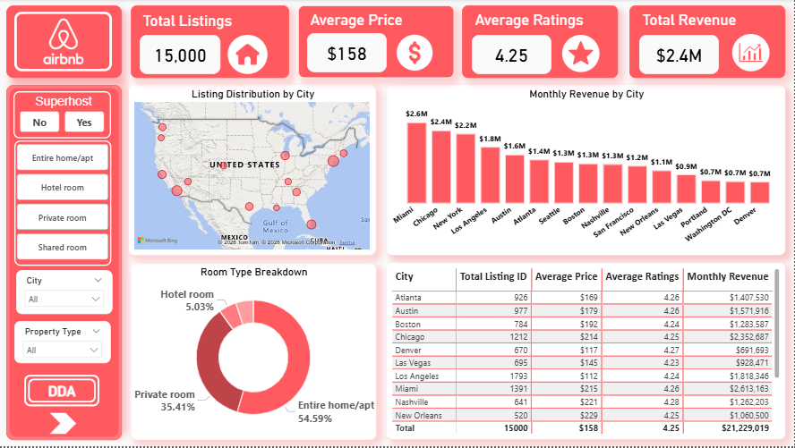
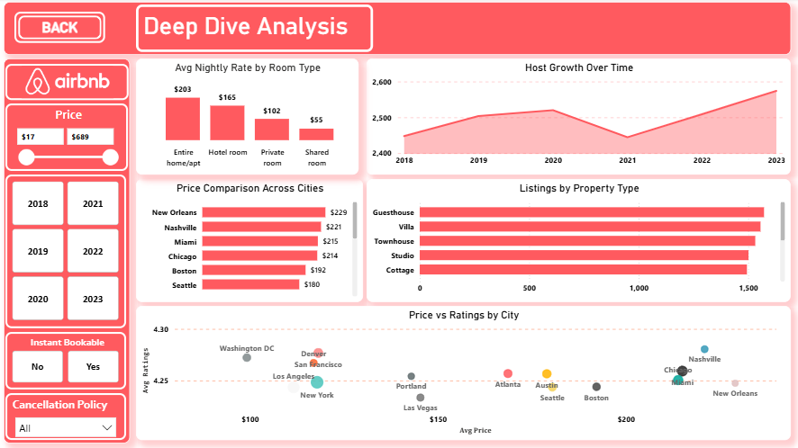

# 🏠 Airbnb US Market Dashboard — Power BI

This was my first Power BI project where I analyzed 
real-world Airbnb data to understand how pricing and 
availability vary across US cities.

---

## 📊 Dashboard Preview

### Page 1 — Overview

### Page 2 — Deep Dive Analysis

---

## 📁 Dataset
- 15,000 rows × 21 columns
- 15 Major US Cities
- Fields: Price, Ratings, Room Type, Host Info, Revenue

---

## 📌 Dashboard Pages

### Page 1 — Overview
- KPI Cards (Total Listings, Avg Price, Avg Rating, Revenue)
- Map Visual by City
- Monthly Revenue by City
- Room Type Breakdown
- City Performance Table

### Page 2 — Deep Dive Analysis
- Avg Nightly Rate by Room Type
- Price Comparison Across Cities
- Host Growth Over Time
- Listings by Property Type
- Price vs Ratings Scatter Plot

---

## 🔲 Interactive Slicers

| Page 1 | Page 2 |
|---|---|
| Superhost | Price Range |
| Room Type | Year Range |
| City | Instant Bookable |
| Property Type | Cancellation Policy |

---

## 💡 Key Insights
- Miami and Chicago have highest monthly revenue
- Entire home listings make up 54% of all listings
- Average rating across all cities is 4.25
- New Orleans has highest average price at $229/night

---

## 🛠️ Tools Used
- Power BI Desktop (Free Version)
- Microsoft Excel
- DAX Measures
- Custom Airbnb Theme (#FF5A5F)
- Custom White Icons

---

## 👤 Author
**kalsotra7006**
GitHub: [@kalsotra7006](https://github.com/kalsotra7006)
